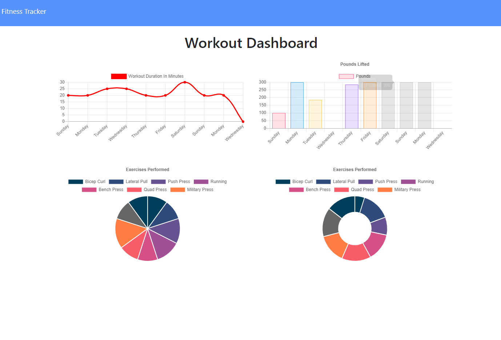
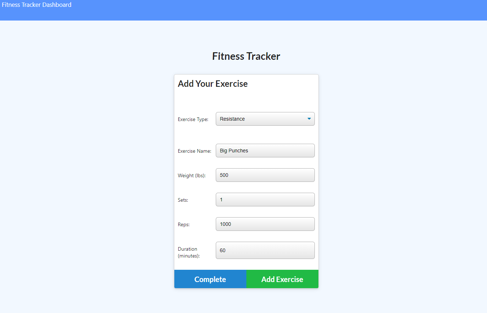

# Fitness Tracker

## Description

This Express Mongo DB web application is designed to allow a user to log information about their exercise routine and view data concerning the workouts as graphs. Mongoose is used as a JavaScript framework in order to connect to and manipulate my NoSQL Mongo database. 

## Table of Contents

* [Link](#Link)

* [Screenshot](#Screenshot)

* [License](#license)

* [Contributing](#contributing)

* [Questions](#questions)

## Link

[This link will take you to the deployed site on Heroku!](https://fitness-chart-app.herokuapp.com/)

## Screenshot

## License

- MIT

- https://opensource.org/licenses/MIT
  
## Contributing

This would not have been possible without the help of my tutor Kumar Ramanathan, my instructor Calvin Carter, all of the class TA's including Sean Belverstone, Daniel Vega, and Brennan Predmoré, and my fellow UT Bootcamp student Priya Garg and many others.

## Questions

If you have any questions about the app, open an issue or contact me through the contact form on my portfolio website: https://priteshpatel823.github.io/. You can find more of my work at [Pritesh Patel](https://github.com/priteshpatel823/fitness-tracker).
